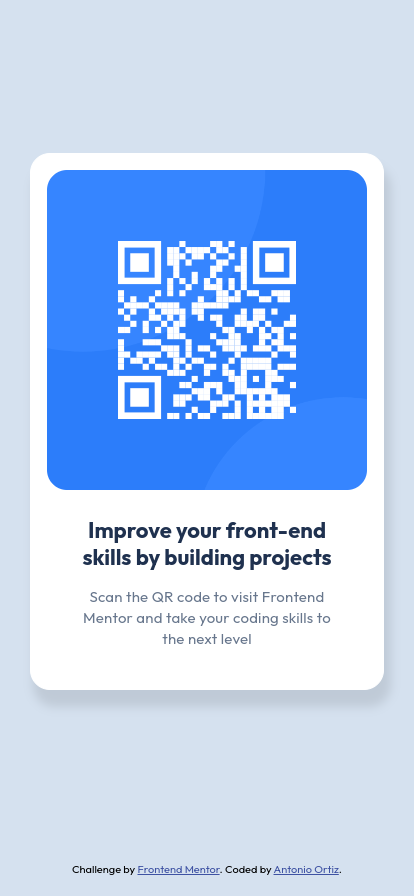

# Frontend Mentor - QR code component solution

This is a solution to the [QR code component challenge on Frontend Mentor](https://www.frontendmentor.io/challenges/qr-code-component-iux_sIO_H). Frontend Mentor challenges help you improve your coding skills by building realistic projects.

## Table of contents

- [Overview](#overview)
  - [Screenshot](#screenshot)
  - [Links](#links)
- [My process](#my-process)
  - [Built with](#built-with)
  - [What I learned](#what-i-learned)
  - [Useful resources](#useful-resources)
- [Author](#author)
- [Acknowledges](#acknowledges)

## Overview

### Screenshot



### Links

- Parent Project: [https://github.com/ortiz-antonio/frontend-mentor](https://github.com/ortiz-antonio/frontend-mentor)
- Solution URL: [https://github.com/ortiz-antonio/qr-code-component](https://github.com/ortiz-antonio/qr-code-component)
- Live Site URL: [https://ortiz-antonio.github.io/qr-code-component/](https://ortiz-antonio.github.io/qr-code-component/)

## My process

### Built with

- Semantic HTML5 markup
- SCSS
- Pug
- Flexbox
- Mobile-first workflow
- [Taskfile](https://taskfile.dev/)
- [Parcel](https://parceljs.org/)

### What I learned

This is the third time I'm doing this challenge because I want to learn well before starting the junior challenges.

What I learned most( Thanks to [@grace-snow](https://www.frontendmentor.io/profile/grace-snow) ) is about the right mindset. In Sass, you need to think of it as metaprogramming for CSS. So, think about how your CSS is built and how you would use it without Sass. Additionally, I learned a lot about accessibility, how to use the accessibility options in Chrome web tools, and how to zoom in on mobile to see how your design adapts.

Also, I used a variation of the 7-in-1 SCSS architecture and used maps for theme and typography. I love how they are used in my component like this:

```scss
.qr__body--title {
  @include typography.size('title');
  color: theme.color('primary');
}
```

### Useful resources

- [Sass guideline](https://sass-guidelin.es/) I learned about how to structure a Sass project and better practices.
- [A successful Sass theme structure](https://codeburst.io/a-successful-sass-theme-structure-ca9d1c477dc7) I like how maps are used for theme and typography.

## Author

- Website - [Antonio Ortiz](https://ortiz.studio)
- Frontend Mentor - [@ortiz-antonio](https://www.frontendmentor.io/profile/ortiz-antonio)

## Acknowledges

[@gmagnenat](https://www.frontendmentor.io/profile/gmagnenat) Thank you for your guidance on best practices.
[@grace-snow](https://www.frontendmentor.io/profile/grace-snow) Thank you, I learned a lot from your blog [fedmentor](https://fedmentor.dev/).
